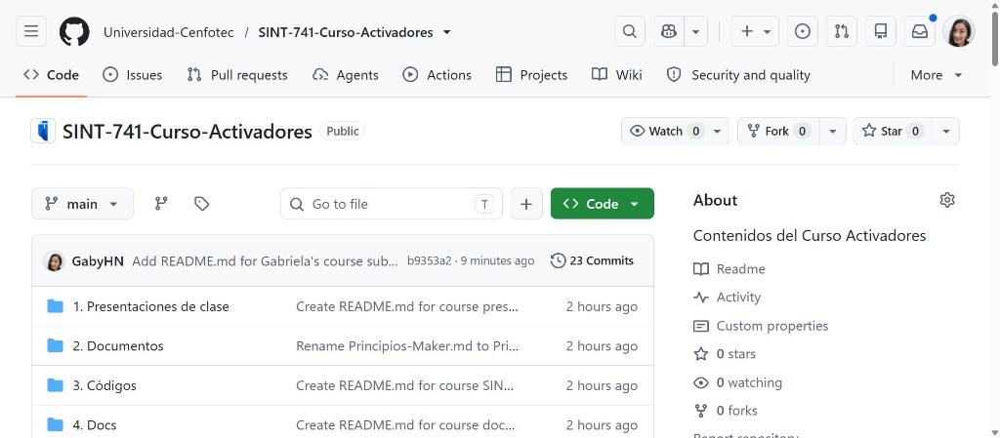
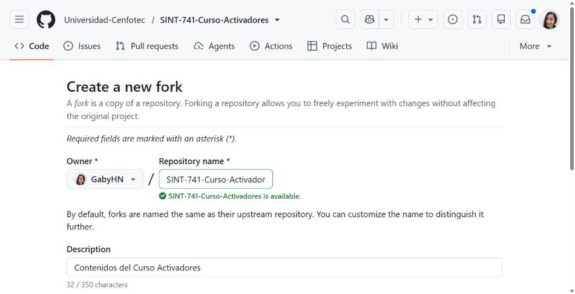
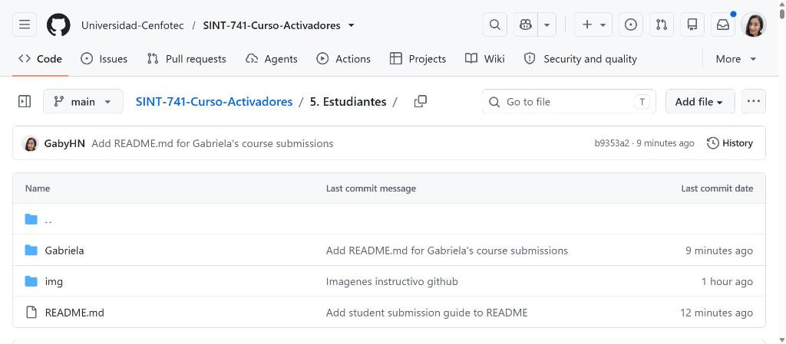
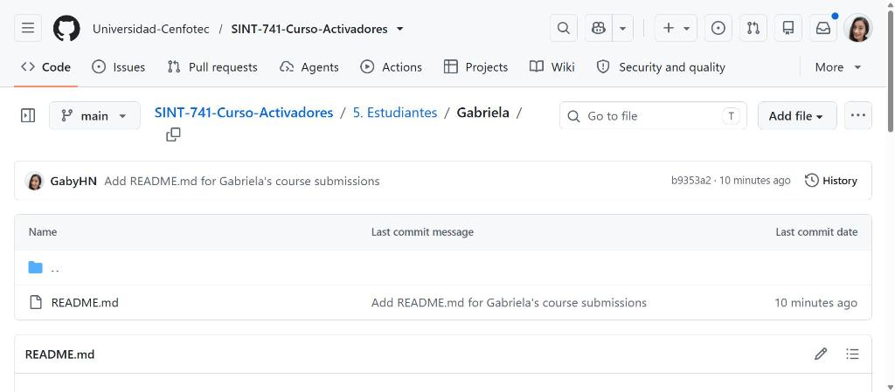
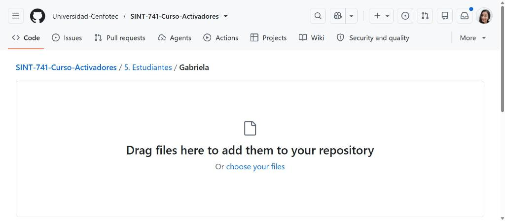
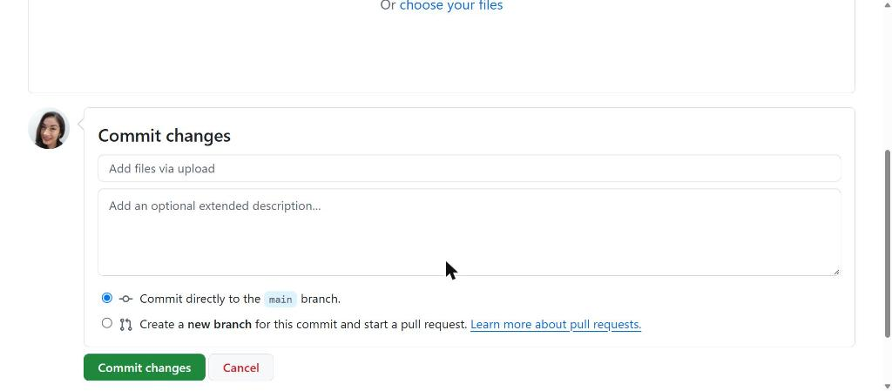
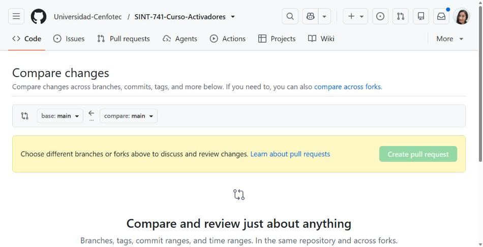

# 4. Estudiantes — Guia para subir tus trabajos

**SINT-741 — Curso Activadores** · Universidad Cenfotec

> El profesor crea tu carpeta dentro de `4. Estudiantes/` con tu nombre.

Ver la guia completa con imagenes mas abajo en esta misma carpeta.

---

## PASO 1 — Crea tu Fork (solo una vez)

Entra al repositorio y haz clic en **Fork** arriba a la derecha.

Deja todo como esta y haz clic en **Create fork**.

> **Esto se hace UNA SOLA VEZ en todo el curso.**

---

## PASO 2 — Entra a tu carpeta

Dentro de tu fork, navega a **4. Estudiantes** y abre la subcarpeta con tu nombre.

> No toques las carpetas de tus companeros.

---

## PASO 3 — Sube tus archivos

Haz clic en **Add file** y elige **Upload files**.

---

## PASO 4 — Commit y Pull Request

Baja hasta **Commit changes** al final:

1. Escribe: `Entrega laboratorio 1 - Tu Nombre`
2. Selecciona **Create a new branch for this commit and start a pull request**
3. Haz clic en **Propose changes**

> Si dejas la primera opcion el profesor NO lo ve.

---

## PASO 5 — Confirma el Pull Request

Verifica que la flecha vaya desde tu fork hacia el repositorio del curso, rama main. Haz clic en **Create pull request**.

**Listo.** Tu entrega quedo registrada.

---

## Reglas

| Regla | Detalle |
|-------|---------|
| Donde subes | Solo dentro de tu subcarpeta en `4. Estudiantes/`. |
| Nombres | Minuscula y guiones: `lab-01-informe.pdf` |
| Un PR por entrega | No mezcles dos trabajos en el mismo PR. |

---

  SINT-741 Curso Activadores · Universidad Cenfotec · Financiado por SENACYT

